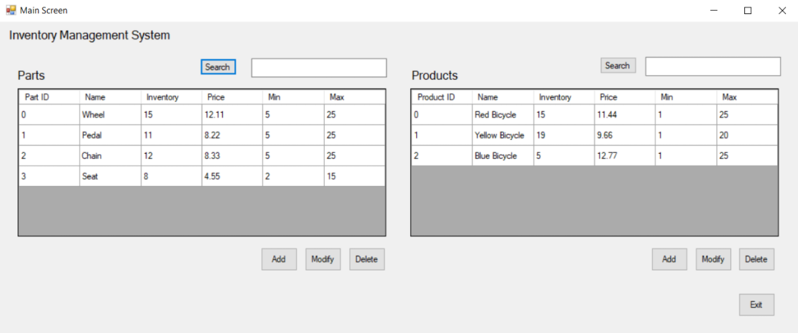

## GUI Mock-Up		

# Main screen

The “Main Screen” displays the current table of parts, and the current table of products.  It allows the user to initiate an add or modify for the parts or products.  It also allows the user to delete a part, or a product.  It allows a user to search for particular parts, or products.  “Exit” shuts down the app.

# Add Part screen
![The Add Part Screen window has the ability to specify a part as In-House or Outsourced using a radio button toggle. The in-house toggle causes the last field to reflect as Machine ID. The Outsourced radio button causes the last field to show as Company Name. The other fields are identical between the two, including ID, Name, Inventory, Price/Cont, Max, and Min. All fields except ID are highlighted in red, indicating that they are required. Unless all fields are complete, the save button is grayed out. There is also a cancel button.](./images/AddPart.png "Add Part Screen")

The user uses this “Add Part” screen to add a part to the parts list, by supplying information about the part, and then selecting “Save”.  After a successful “Save”, the user is returned to the main screen.  If the user selects “Cancel”, no part will be added to the parts list, and the screen will revert to the main screen.  

The user has the option to select “In-House” or “Outsourced” to categorize the part.  If the user selects “Outsourced,” the “Company Name” field is available.  If the user selects “In-House,” the “Machine ID” field is available.  This is highlighted in the figures, using the arrows.

The “Inventory” field contains how many of these parts the company currently has available. The “Min” field contains the minimum number of these parts allowed.  The “Max” field contains the maximum number of these parts allowed. The value of “Inventory” must be an integer between the values in “Min” and “Max.”  You do not need to dynamically manage (decrement/increment) the value in “Inventory”, as you add/delete parts in the associated parts list of a product.

# Modify Part screen

![The Modify Part Screen window has the ability to specify a part as In-House or Outsourced using a radio button toggle. The in-house toggle causes the last field to reflect as Machine ID. The Outsourced radio button causes the last field to show as Company Name. The other fields are identical between the two, including ID, Name, Inventory, Price/Cont, Max, and Min. All fields except ID are highlighted in red, indicating that they are required. Unless all fields are complete, the save button is grayed out. There is also a cancel button.](./images/ModifyPart.png "Modify Part Screen")

The user uses this “Modify Part” screen to modify a part selected by the user, that is already in the parts list, by supplying information about the part, and then selecting “Save”.  After a successful “Save”, the user is returned to the main screen.  If the user selects “Cancel”, no modifications to the part in the parts list will be made, and the screen will revert to the main screen.  

As in the Add Part form, the Modify Part form allows the user to select “In-House” or “Outsourced” to categorize the part.  The “Modify Part” screen has the same functionality as the “Add Part” screen, however, the “Modify Part” screen text-boxes are populated with data from an already existing part, that was previously selected by the user.  

# Add Product screen

![The Add Product Screen window contains two tables and several data fields. The data fields are ID, Name, Inventory, Price, Min, and Max. All fields except ID are highlighted in red, indicating that they are required. The first table is "All candidate parts". This shows all parts in the system. It has a search box above the table. Below, it has an Add button, so that you can select a part and add it. When you add a part, it appears in the second table, "Parts Associated with the Product". In this table, you may select an added part, and click a delete button. Unless all fields are complete, the save button is grayed out. There is also a cancel button.](./images/AddProduct.png "Add Product Screen")

The user uses this “Add Product” screen to add a product to the products list, by supplying information about the product, and then selecting “Save”.  After a successful “Save”, the user is returned to the main screen.  If the user selects “Cancel”, no product will be added to the products list, and the screen will revert to the main screen. 

The “Add Product” screen allows the user to select and add parts from the upper grid to the associated parts list in the lower grid.  When added, the selected part is associated with that product, and appears in the lower grid.  It is not removed from the upper grid.  The user can select and delete parts from the lower grid, effectively disassociating the part from that product.

The upper grid represents all candidate parts, and can be labelled as such (see image).  The lower grid represents the parts associated with the product, and can be labelled as such (see image).  

The “Inventory” field contains how many of these products the company currently has available. The “Min” field contains the minimum number of these products allowed.  The “Max” field contains the maximum number of these products allowed. The value of “Inventory” must be an integer between the values in “Min” and “Max”. 

# Modify Product screen

![The Modify Product Screen window contains two tables and several data fields. The data fields are ID, Name, Inventory, Price, Min, and Max. All fields except ID are highlighted in red, indicating that they are required. The first table is "All candidate parts". This shows all parts in the system. It has a search box above the table. Below, it has an Add button, so that you can select a part and add it. When you add a part, it appears in the second table, "Parts Associated with the Product". In this table, you may select an added part, and click a delete button. Unless all fields are complete, the save button is grayed out. There is also a cancel button.](./images/ModifyProduct.png "Modify Product Screen")

The user uses this “Modify Product” screen to modify a product selected by the user, that is already in the products list, by supplying information about the product, and then selecting “Save”.  After a successful “Save”, the user is returned to the main screen.  If the user selects “Cancel”, no modifications to the product in the products list will be made, and the screen will revert to the main screen.

The “Modify Product” screen has the same functionality as the “Add Product” screen, however, the “Modify Product” screen parts and fields are populated with data from an already existing Product, that was previously selected by the user.

It is acceptable, but not required, for the app to use a single form (C# file) for both Add and Modify Part screens.  It is acceptable, but not required, for the app to use a single form (C# file) for both Add and Modify Product screens.  Consult with your course instructor, if this is unclear, or you need further explanation.

The ID fields for both the Parts and Products should display auto-generated (unique) numbers.  These ID fields should not allow user modifications.

Watch an example [video of a PA solution with the GUI in action](https://wgu.hosted.panopto.com/Panopto/Pages/Viewer.aspx?id=d6a807b5-919e-4d42-bb88-a922012975de).  This is just an example.  It represents one of many possible approaches to a solution.

# Class Diagram

